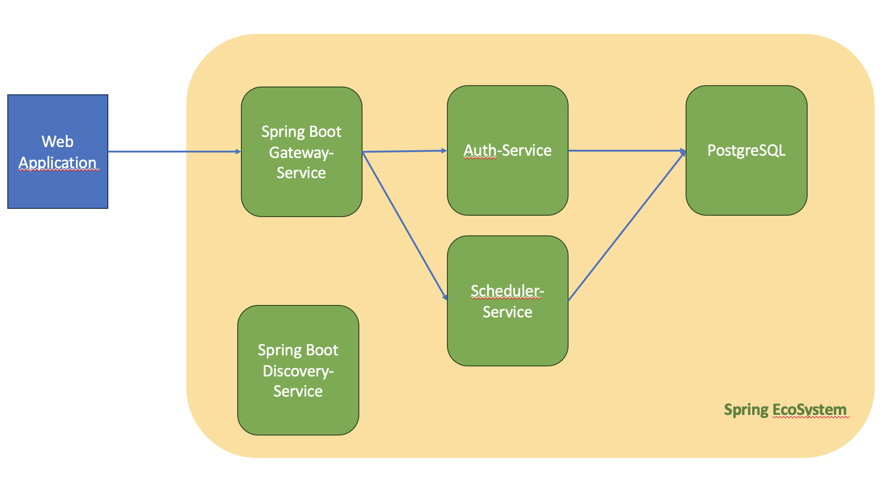

# jacto-scheduler-web

## Getting Started
This project is based on Spring Boot 3 and intends to offer microservices for a scheduler, with authentication support.

## Architecture

The following microservices-based projects are inside this repository:
- **gateway-service** - a module for running Spring Boot application that acts as a proxy/gateway in our architecture.
- **discovery-service** - a module that orchestrates other Spring microservices.
- **auth-service** - a module that allows to perform CRUD operation on PostgreSQL Users Database. Also responsible for generating JWT Tokens to be used with Scheduler-service
- **scheduler-service** - a module to perform CRUD operation on PostgreSQL Schedules Database. Also exposes auxiliary API for postal code address completion.

The following picture illustrates the architecture described above.

